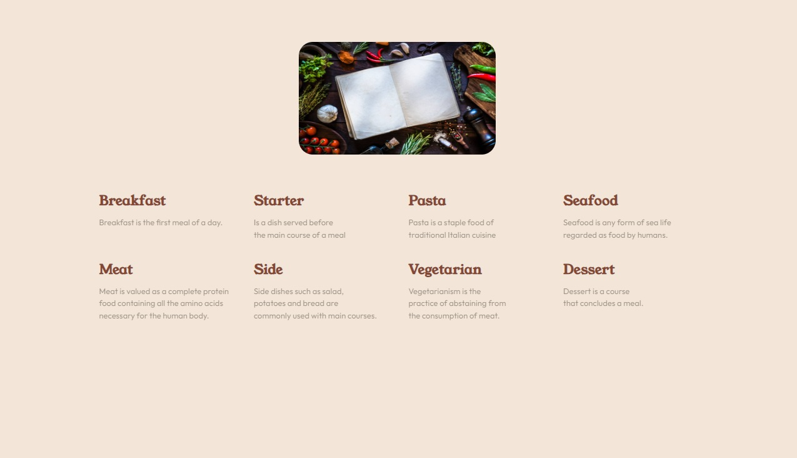
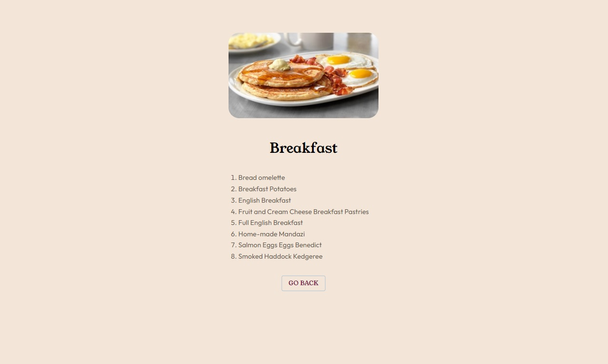

# Frontend Mentor - Recipe page solution

This is a solution to the [Recipe page form challenge on Frontend Mentor](https://www.frontendmentor.io/challenges/recipe-page-KiTsR8QQKm). Frontend Mentor challenges help you improve your coding skills by building realistic projects. 

## Table of contents

- [Overview](#overview)
    - [The challenge](#the-challenge)
    - [Screenshot](#screenshot)
    - [Links](#links)
- [My process](#my-process)
    - [Built with](#built-with)
- [Getting Started](#getting-started)
- [Deployment](#deployment)
- [Author](#author)

## Overview

### The challenge

Users could:

- See recipe lists on different categories
- Look up selected recipe details
- Go back to a previous step
- View the optimal layout for the interface depending on their device's screen size

### Screenshots





### Links

- [Live URL](https://mary2021.github.io/recipePage/)

## My process

### Built with

- [Next.js](https://nextjs.org/) project bootstrapped with [`create-next-app`](https://github.com/vercel/next.js/tree/canary/packages/create-next-app).

- [Material UI](https://mui.com/material-ui/)

- Recipes fetched from [TheMealDB API](https://www.themealdb.com/)

## Getting Started

First, run the development server:

```bash
npm run dev
# or
yarn dev
# or
pnpm dev
# or
bun dev
```

Open [http://localhost:3000](http://localhost:3000) with your browser and add basePath to see the result.

You can start editing the page by modifying `app/page.tsx`. The page auto-updates as you edit the file.

This project uses [`next/font`](https://nextjs.org/docs/basic-features/font-optimization) to automatically optimize and load Inter, a custom Google Font.

To learn more about Next.js, take a look at the following resources:

- [Next.js Documentation](https://nextjs.org/docs) - learn about Next.js features and API.
- [Learn Next.js](https://nextjs.org/learn) - an interactive Next.js tutorial.

You can check out [the Next.js GitHub repository](https://github.com/vercel/next.js/) - your feedback and contributions are welcome!

## Deployment

Check out our [Next.js deployment documentation](https://nextjs.org/docs/deployment) for more details.

[How to Deploy Next.js Apps to Github Pages](https://www.freecodecamp.org/news/how-to-deploy-next-js-app-to-github-pages/)

## Author

- Website - [Mary P](https://github.com/Mary2021)